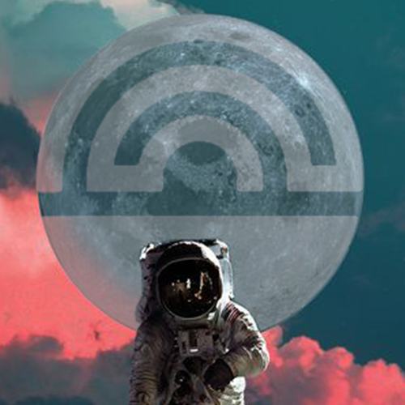

<!-- PROJECT LOGO -->
 

  

  <h3 align="center">Filter Criteria ❌✅</h3>

  

    Definitions and descriptions of criteria required for a proposal to pass The Great Filter.
  

<!-- TABLE OF CONTENTS -->

  
Table of Contents

  <ol>
    <li><a href="#problem-statement">Problem Statement</a></li>
    <li><a href="#clear-goals">Clear Goals</a></li>
    <li><a href="#target-demographic">Target Demographic</a></li>
    <li><a href="#action-plan">Action Plan</a></li>
    <li><a href="#roadmap">Roadmap</a></li>
    <li><a href="#performance-metrics">Performance Metrics</a></li>
    <li><a href="#skills-required">Skills Required</a></li>
    <li><a href="#budget-breakdown">Budget Breakdown</a></li>
  </ol>

<!-- PROBLEM STATEMENT -->
## Problem Statement 📩
### Requirement
Provide description of issue/deficiency.
### Description
A detailed description of the problem or opportunity for improvement the proposal aims to relieve.
### Hints
* What is your proposal trying to solve?

<!-- CLEAR GOALS -->
## Clear Goals 🏆
### Requirement
Provide description of desired outcome.
### Description
A clear definition of the intended succesful outcome of the completed proposal.
### Hints
* What does your proposal want to achieve?

<!-- TARGET DEMOGRAPHIC -->
## Target Demographic 👨‍👩‍👦
### Requirement
Specify intended target group
### Description
An account of whom exactly the proposal intends to provide a positive change for.
### Hints
* Who are the intended beneficiaries of your proposal?

<!-- ACTION PLAN -->
## Action Plan ✊
### Requirement
Provide details of actionable intent.
### Description
A description of what work you plan on doing to progress towards your goals, in order of execution.
### Hints
* What actionable tasks will you do, in what order?
* How are you going to progress towards your goals?

<!-- ROADMAP -->
## Roadmap 📅
### Requirement
Provide a timeline outline of development plans
### Description
An account of what work will be done at what time. Milestones and deliverables, layed out with chronological estimates.
### Hints
* How long is your development going to last? 
* When do you expect to deliver on your proposal?
* Will you provide gradual results, or everything at once?
* Is your proposal a standalone project, or one chapter of a bigger book?

<!-- PERFORMANCE METRICS -->
## Performance Metrics 📈
### Requirement
Specify what key performance indicators will be used to quantity the success of the proposal
### Description
A clear definition of what quantifiable metrics you will employ, in order to determine whether your work is failing or succeeding at achieving your goals.
### Hints
* How do you measure whether your work is a success or a failure?
* Are you measuring your acceptance criteria objectively?

<!-- SKILLS REQUIRED -->
## Skills Required 👨‍🎓
### Requirement
Account for what experience/skillsets will be necessary to deliver on the proposal
### Description
An account of what skills are required for your proposal to be implemented. Even if you don't have said skills yourself, by showing you are aware of what's needed, you show you know what you need to either learn or hire help for.
### Hints
* What skills or experience is required to deliver on your proposal?
* What capabilities will a person/team need to possess, in order to carry out your proposal?

<!-- BUDGET BREAKDOWN -->
## Budget Breakdown 💰
### Requirement
Provide description of intended use of requested budget
### Description
A description of what expenses your requested budget will be used to cover.
### Hints
* What are you going to spend the money on?
* Are you taking personal compensation?

